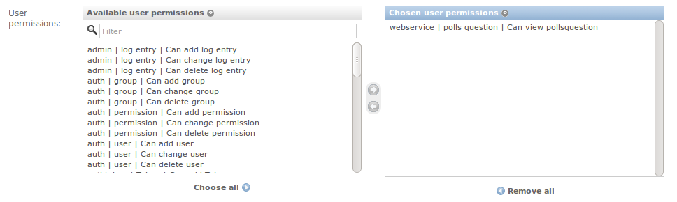
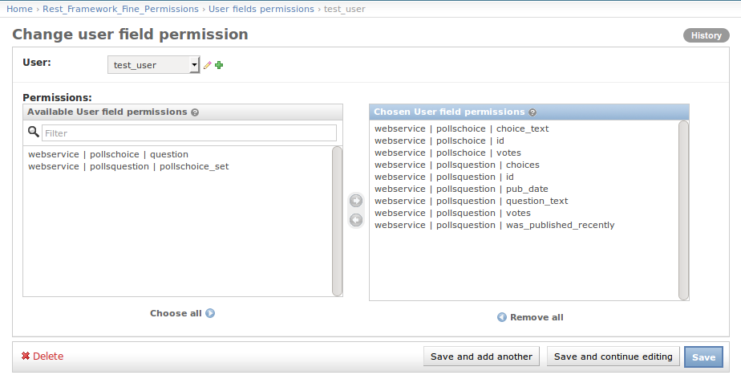

django-rest-framework-fine-permissions
======================================

New permissions possibilities for rest-framework

Compatibility
-------------

Works with :

  * Python 2.7, 3.3, 3.4, 3.5
  * Django >= 1.8
  * Django Rest Framework >= 3.3

.. image:: https://travis-ci.org/unistra/django-rest-framework-fine-permissions.svg?branch=master
    :target: https://travis-ci.org/unistra/django-rest-framework-fine-permissions

.. image:: https://coveralls.io/repos/github/unistra/django-rest-framework-fine-permissions/badge.svg?branch=master
    :target: https://coveralls.io/github/unistra/django-rest-framework-fine-permissions?branch=master

.. image:: https://landscape.io/github/unistra/django-rest-framework-fine-permissions/master/landscape.svg?style=flat
    :target: https://landscape.io/github/unistra/django-rest-framework-fine-permissions/master
    :alt: Code Health

Installation
------------

Install the package from pypi :

.. code-block:: sh

    pip install djangorestframework-fine-permissions

Configure your `settings.py` module :

.. code-block:: python

    INSTALLED_APPS = (
        ...
        'rest_framework_fine_permissions',
    )

    REST_FRAMEWORK = {
        'DEFAULT_FILTER_BACKENDS': (
            # Enable the filter permission backend for all GenericAPIView
            'rest_framework_fine_permissions.filters.FilterPermissionBackend',
        ),

        'DEFAULT_PERMISSION_CLASSES': (
            # Enable the django model permissions (view,create,delete,modify)
            'rest_framework_fine_permissions.permissions.FullDjangoModelPermissions',
            # OPTIONAL if you use FilterPermissionBackend and GenericAPIView. Check filter permissions for objects.
            'rest_framework_fine_permissions.permissions.FilterPermission',
        )
    }

Sync the django's database :

.. code-block:: sh

    python manage.py syncdb

Edit your `urls.py` module :

.. code-block:: python

    from django.conf.urls import url
    from django.contrib import admin
    from rest_framework_fine_permissions.urls import urlpatterns as drffp_urls

    urlpatterns = [
        url(r'^admin/', admin.site.urls),
    ]
    urlpatterns += drffp_urls

Usage
-----

 * Go to the django admin page
 * Add field's permissions to a user with the "User fields permissions" link
 * Add filter's permissions to a user with the "User filters permissions" link

Example
-------

``models.py`` :

.. code-block:: python

    from django.db import models
    from django.db.models import Sum

    class PollsChoice(models.Model):
        id = models.IntegerField(primary_key=True)
        choice_text = models.CharField(max_length=200)
        votes = models.IntegerField()
        question = models.ForeignKey('PollsQuestion')

        class Meta:
            permissions = (('view_pollschoice', 'Can view pollschoice'),)

    class PollsQuestion(models.Model):
        id = models.IntegerField(primary_key=True)
        question_text = models.CharField(max_length=200)
        pub_date = models.DateTimeField()

        class Meta:
            permissions = (('view_pollsquestion', 'Can view pollsquestion'),)

        @property
        def sum_votes(self):
            return self.pollschoice_set.aggregate(total=Sum('votes'))['total']

        @property
        def choices(self):
            return self.pollschoice_set.all()

``serializers.py`` :

.. code-block:: python

    import datetime
    from django.utils import timezone
    from rest_framework import serializers
    from rest_framework_fine_permissions.fields import ModelPermissionsField
    from rest_framework_fine_permissions.serializers import ModelPermissionsSerializer

    from . import models

    class PollsChoiceSerializer(ModelPermissionsSerializer):
        class Meta:
            model = models.PollsChoice

    class PollsQuestionSerializer(ModelPermissionsSerializer):
        was_published_recently = serializers.SerializerMethodField()
        votes = serializers.IntegerField(source='sum_votes')
        choices = ModelPermissionsField(PollsChoiceSerializer)

        class Meta:
            model = models.PollsQuestion

        def get_was_published_recently(self, obj):
            return obj.pub_date >= timezone.now() - datetime.timedelta(days=1)

``views.py`` :

.. code-block:: python

    from . import models
    from . import serializers
    from rest_framework import generics

    class PollsChoiceDetail(generics.RetrieveUpdateDestroyAPIView):
        queryset = models.PollsChoice.objects.all()
        serializer_class = serializers.PollsChoiceSerializer

``urls.py`` :

.. code-block:: python

    from django.conf.urls import patterns, url
    from rest_framework.urlpatterns import format_suffix_patterns
    from . import views

    urlpatterns = [,
        url(r'^pollsquestion/(?P<pk>\w+)$', views.PollsQuestionDetail.as_view(), name='pollsquestion-all-detail'),
    ]
    urlpatterns = format_suffix_patterns(urlpatterns, suffix_required=True)

Create a user without the staff and superuser status, and add him permissions :

Then add user field permissions :

You can finally call your webservice :

.. code-block:: sh

    $ curl -X GET -H "Authorization: Token TOKEN" -H "Accept: application/json; indent=4" http://127.0.0.1/webservice/pollsquestion/1.json
    {
        "choices": [
            {
                "choice_text": "Yes",
                "id": 1,
                "votes": 5
            },
            {
                "choice_text": "No",
                "id": 2,
                "votes": 2
            }
        ],
        "id": 1,
        "pub_date": "2017-01-08T09:00:00",
        "question_text": "Is this a question ?",
        "votes": 7,
        "was_published_recently": false
    }

Import/Export
-------------

To export field's permissions, you can use the following command : ::

    python manage.py fine_permissions_dump myuser > /tmp/myuserfieldsperms.json

To import field's permissions, you can use the following command : ::

    python manage.py fine_permissions_load -u anotheruser /tmp/myuserfieldsperms.json
